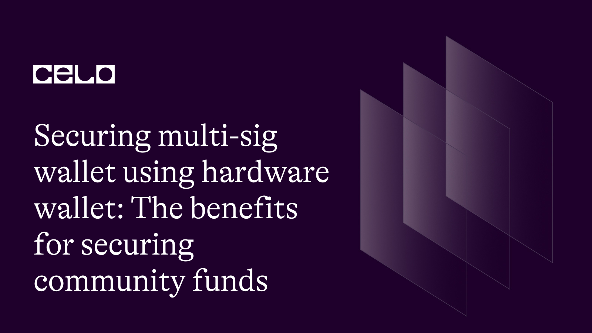
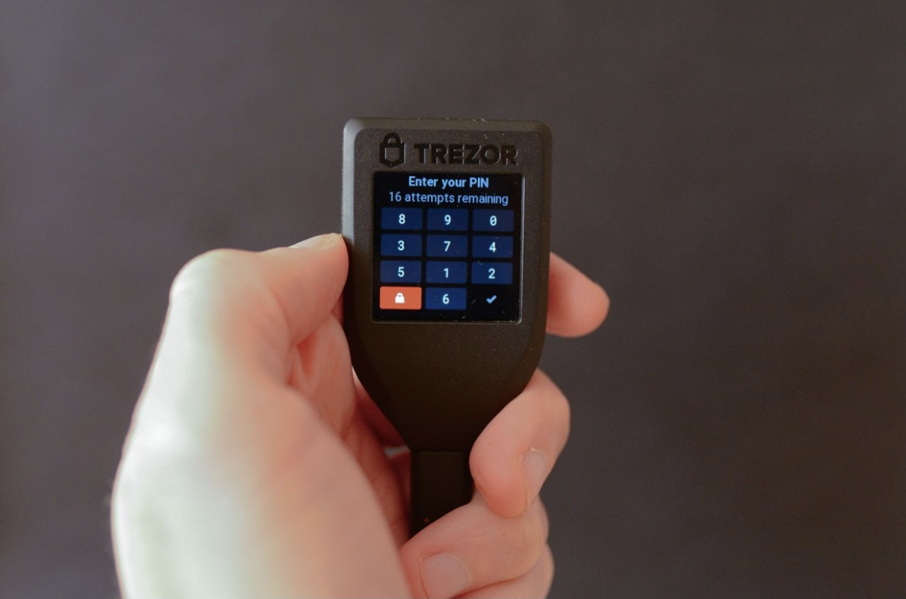
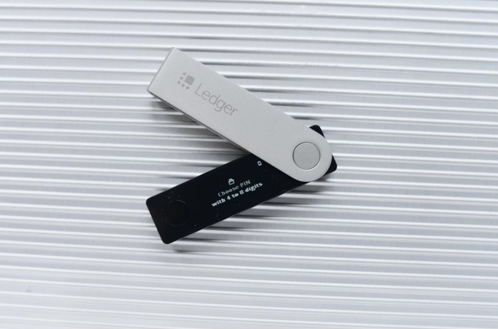
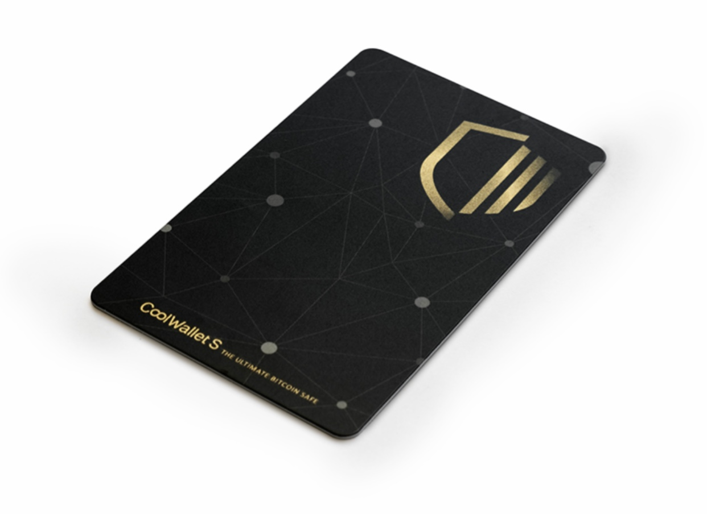
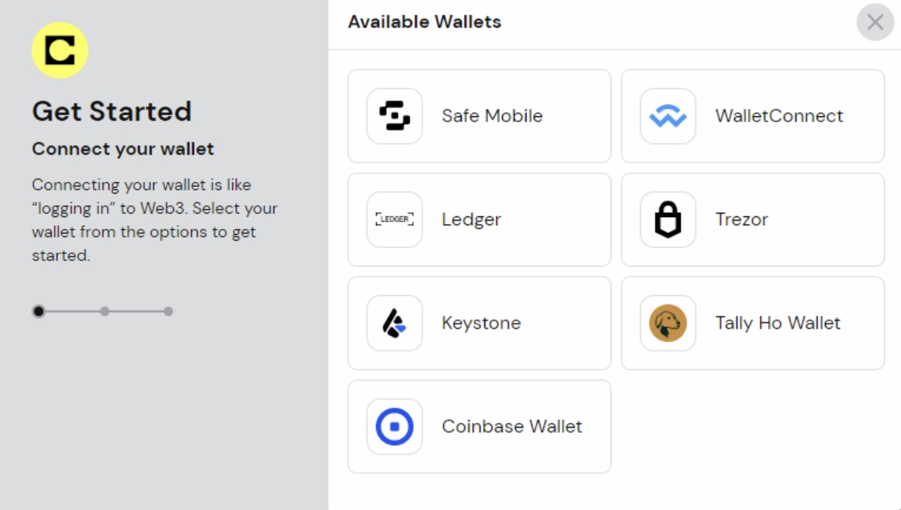

## Introduction

Securing community funds is essential in the world of cryptocurrencies. Using a hardware wallet and a multi-sig wallet is one efficient way to accomplish this. Storing large cryptocurrency holdings in a single wallet comes with inherent risks, but using a multi-sig wallet adds an extra layer of protection. In this tutorial, we'll review the benefits of securing community funds and the advantages of combining a hardware wallet with a multi-sig wallet.

## Prerequisites

Readers should have a fundamental understanding of Celo and be acquainted with hardware wallets before beginning this tutorial. You will more likely follow along with the technical content and complete this tutorial if you have these prerequisites.

## Requirements

To complete this tutorial, you need a basic knowledge of  Celo and hardware wallets.

## What is a Hardware Wallet?

A hardware wallet is a specialized tool to keep private keys safe and secure offline. This makes it extremely difficult for malware or hackers to access your keys and take your belongings. You can access assets and sign transactions on a hardware wallet even without connecting to a computer, because not all hardware wallets require connecting to one. Trezor, Ledger, and KeepKey are a few well-known hardware wallets.

*A Trezor Wallet*

*A Ledger Wallet*

## What is a Multi-Sig Wallet?

A multi-signature wallet is a cryptocurrency wallet that necessitates multiple signatures or approvals from various parties for a transaction to be carried out. This increases security and lowers the chance of theft or unauthorized access. Each party must have its own private key when setting up a multi-sig wallet and gather a certain number of signatures before a transaction can be approved. Celo Safe is a popular example.

Celo Safe is a smart contract wallet designed specifically for the Celo network. It allows users to securely manage their Celo assets, including CELO, cUSD, and other Celo-based assets, in a decentralized and non-custodial manner. Celo Safe is built on top of the Celo blockchain and leverages the security and transparency of the blockchain to ensure the safety and integrity of community funds.

By using Celo Safe to manage community funds, users can be confident that their assets are secure and that they are contributing to the growth and success of the Celo ecosystem.

## Benefits of Securing Community Funds Using Multi-sig Wallet with Hardware Wallet

### Security

A combination of a hardware wallet and a multi-signature wallet creates an enhanced level of security against possible theft. One perk of the multi-signature aspect is that if one signature gets into malevolent hands, it becomes ineffective without support from additional signings. Additionally, private keys are protected within hardware wallets, far from hacking or malware intrusions, to increase safety measures further.

For cryptographic equipment, the highest level of security certification remains EAL5+. The advanced security benefits of an EAL5+-certified hardware wallet go beyond just guaranteeing the safety and security of your assets. It guarantees that the wallet has been tested and evaluated to ensure its defense against tampering, hacking attempts, and malware.

### Control 

We can avoid mistakes by using a hardware wallet and a multi-sig wallet. There is less chance of a single person making a mistake that could lead to the loss of community funds because multiple people are involved in approving transactions. Furthermore, there is a lower possibility of unintentionally sending money to the incorrect address because the private keys are kept in a hardware wallet. 
 
In other words, syncing these two technologies gives you total control over your finances. Only you and the authorized staff can access the community funds when using a multi-sig wallet with a hardware wallet. By doing this, you completely rule out the possibility of a third party stealing your private keys, such as an exchange or an online wallet provider.

### Transparency and Accountability

Transparency and accountability are two other benefits of syncing a multi-signature wallet with a hardware wallet. There is less opportunity for fraud attempts or financial abuse when multiple people must approve transactions. This is particularly key for community funds because there may be numerous stakeholders.
 
Additionally, if you lose your device or forget your PIN, it contains recovery seeds—a string of words—that you can use to locate your wallet. Therefore, you can still access your money even if your hardware wallet is stolen or lost.

## Choosing the Right Hardware Wallet: Your Options

**USB Hardware Wallet:** Hardware wallets that use USB connectivity are known as USB hardware wallets. They are a popular option for those interested in cryptocurrencies because they are small and straightforward. Ledger Nano X and Trezor One are two popular USB hardware wallet models. 

**Wireless Hardware Wallet:** Bluetooth can link wireless hardware wallets to a computer or mobile device. Being wirelessly accessible makes them more practical to use. Devices like the Ledger Nano S and the Trezor Model T are examples of wireless hardware wallets. 
 
**Multiple-currency Hardware Wallet:** Hardware wallets that support multiple cryptocurrencies are known as "multi-currency wallets," offering users of cryptocurrencies various options. They frequently accept a variety of cryptocurrencies, such as CELO, Bitcoin, Ethereum, and Litecoin. Ledger Nano X and Trezor Model T are two examples of multi-currency hardware wallets. 
 
**Mobile Hardware Wallet:** Mobile hardware wallets allow users to access their cryptocurrencies while on the go. They are made to work with mobile devices. Compared to USB or wireless hardware wallets, they are usually more compact and portable. Trezor Mobile and Ledger Live Mobile are examples of mobile hardware wallets. 

**Card Hardware Wallet:** Here is another preferred choice. Your private keys are kept in these credit-card-sized gadgets. Although they can cost more than other kinds of hardware wallets, they are sturdy and convenient to carry around. CoolWallet S is a popular example.

*CoolWallet S*

## Choosing the Right Hardware Wallet: Tips

Given the variety of options, you must identify your unique requirements and do adequate research before choosing. By following the tips given below, you'll be able to choose the best hardware wallet for your needs and feel secure knowing that your cryptocurrency is safe.
 
* **Figure Out Your Needs**

A hardware wallet card could be the best choice if you travel frequently. A USB hardware wallet might be a better option if you're worried about security. And a mobile hardware wallet phone might be the best option if you prefer the ease of a mobile app.  

* **Currency Support** 

Every hardware wallet can't support every cryptocurrency. Verify if the wallet you choose can store the cryptocurrency you want. It's important to remember that some wallets support several cryptocurrencies, while others only support a limited selection. To find out which currencies are supported, visit the manufacturer's website, but be aware that currency support may evolve. 

* **Manufacturer's Standing and Track Record** 

Select a company with a good reputation that has been around for a while. Doing this assures you that you're getting a trustworthy item from a reputable business. To get a sense of the manufacturer's customer service and general reputation, you can also look up their background, read customers' reviews, and look them up on social media.

* **Security Standards**

Purchase a wallet with a security rating of EAL5+. By so doing, you can rest assured your hardware wallet will work effectively. To further boost security for community funds, consider using a multi-sig wallet and your hardware wallet. With this setup, it is much more difficult for anyone to access the community funds without authorization, which necessitates multiple signatures for each transaction.

## Connecting to Celo Safe and Securing your Wallet

You can confidently set up and connect your hardware wallet to Celo Safe by following the steps provided below. Remember to take the proper safety measures to protect your hardware wallet and recovery seed. 
 
**Step 1: Get Your Hardware Wallet**

Getting a hardware wallet is the first step in setting it up. Several reliable companies, including Ledger, Trezor, and KeepKey, make hardware wallets. 
Tip: Only buy from the manufacturer or a reputable reseller when purchasing. 
 
**Step 2: Install the Required Software**

Go to the official website of your hardware wallet and download the software required for connection. Install the software and follow the prompts to set it up.
 
**Step 3: Connect Your Hardware Wallet to Celo Safe**

Open the Celo Safe app and select "Create Safe" to create a new safe or "Add existing safe" if you already have one. Click on “Connect” and choose the type of hardware wallet you have, then follow the prompts to connect it. You can also tap on the wallet icon in the top-right corner of the screen to connect your wallet directly.

_Tip: Your hardware wallet should always be kept in a secure location._

**Step 4: Access Your Tokens Using Your Hardware Wallet**

To access Celo tokens using your hardware wallet, open the Celo Safe app and select the "My Safes" tab. Your hardware wallet will be listed as one of the accounts. You can now add other people or accounts to 'My Safes' to manage community funds.

**Step 5: Transfer Celo Tokens to Your Hardware Wallet**

Once you have added the required people to "My Safes," the community funds can be managed by the authorization of these members to transfer and receive funds. Go to the "My Safes" tab in Celo Safe, select “Send," and enter the amount to transfer. Choose your hardware wallet as the "From" account and enter the recipient's address. 

**Step 6: Confirm the Transaction**

On the hardware wallet of the authorized members, they will be prompted to confirm the transaction. They will verify the details, enter their PIN or passphrase, and confirm the transaction. 
Tip: Always verify the address twice before sending any money there.

**Step 7: Keep Your Hardware Wallet Secure**

Remember to keep your hardware wallet safe and secure. Do not share your PIN or passphrase with anyone, and keep your hardware wallet in a safe place.
_Tip: For maximum security, keep the firmware on your hardware wallet updated and do not divulge your recovery seed to anyone._

## Conclusion

We are glad you completed our tutorial on using a multi-signature and hardware wallet to secure community funds. You now fully understand how crucial it is to keep community funds safe and secure, and you can appreciate how useful and reassuring using these two technologies can be. 
 
Remember that syncing a multi-sig wallet with a hardware wallet can help you store your cryptocurrencies safely, manage and expand your investment portfolio, and secure community funds. Congratulations on starting the process of securing and managing community funds!

## Next Steps 

The next step is to learn more about cryptocurrency security. And I recommend the resources below: 
 
* Celo Safe: https://old-safe.celo.org/#/welcome
* The Ledger Academy: https://www.ledger.com/academy/security 
* The security page for Trezor: https://trezor.io/security
* The Beginner's Guide to Cryptocurrency Wallets: https://www.security.org/crypto/wallet/

## About the Author

Boyejo Oluwafemi is a hardware product developer working at the intersection of hardware and blockchain technology. He’s working to leverage his wealth of experience working on several products ranging from smart health devices to sporting gadgets to deliver smart payment solutions for crypto for a more inclusive future. 

## References

* Crypto.com. What is Hardware Wallet, and How Does it Work? Retrieve from https://crypto.com/university/what-is-a-hardware-wallet 
* Kinesis Money. 6 Advantages of Hardware Wallets in 2021. Retrieve from https://kinesis.money/blog/6-best-advantages-of-hardware-wallets-in-2021/
* Trezor Blog. Why you need a hardware wallet. Retrieved from https://blog.trezor.io/why-you-need-a-hardware-wallet-eaf966c5c193
* Investopedia. The Best Bitcoin Wallets. Retrieved from https://www.investopedia.com/best-bitcoin-wallets-5070283
* Celo Safe: https://safe.celo.org/welcome
* Money. 8 Best Crypto Wallets of January 2023. Retrieved from https://money.com/best-crypto-wallets/
* TechTalk. Why You Should Consider a Hardware Wallet if You’re New to Bitcoin. Retrieve from https://bdtechtalks.com/2021/03/12/bitcoin-hardware-wallets/

